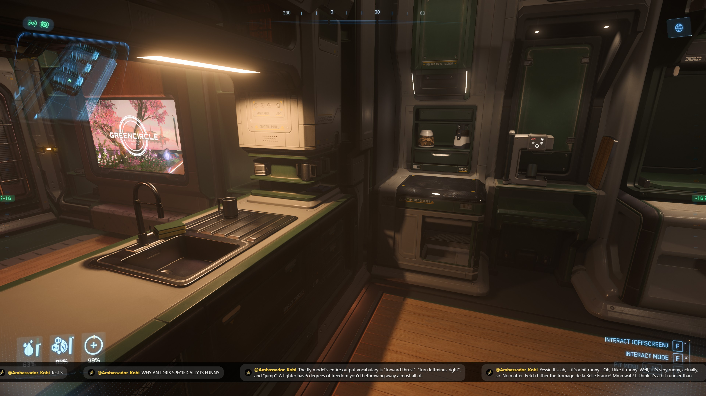

# YouTube Chat Overlay

A translucent, click-through window that sits on top of your game and shows
your YouTube live chat, so you don't need a browser tab open to follow it.

- Auto-detects your channel's active live broadcast (no pasting URLs).
- Click-through by default — clicks pass straight to the game underneath.
- Hotkey to unlock it for moving/resizing, then lock it back.
- Highlights moderators, members, and Super Chats.
- Two layouts, switchable live with a hotkey or by editing `config.json`:
  a **stacked** box of recent messages, or a **ticker** — a thin strip
  along the bottom of the screen where messages scroll right to left, so
  they never sit on top of your inventory/HUD.

**Windows only** as written (uses Windows-friendly always-on-top behavior);
it's Electron underneath so it *can* run on macOS/Linux too, but you'd want
to double check the window-level settings in `main.js` first.

## Screenshots



## Made with Claude

Made using Claude Sonnet 5 High

## 1. One-time Google Cloud setup

YouTube's live chat API requires you to sign in with your own Google account
(OAuth), not just an API key — that's what lets the app ask "what is *my*
channel streaming right now". This is a five-minute, one-time setup.

1. Go to [console.cloud.google.com](https://console.cloud.google.com/) and
   create a new project (top bar → New Project). Any name is fine.
2. **Enable the API**: in the left menu go to *APIs & Services → Library*,
   search for **YouTube Data API v3**, and click **Enable**.
3. **Configure the consent screen**: *APIs & Services → OAuth consent
   screen*.
   - User type: **External**.
   - App name: anything (e.g. "My Chat Overlay"), pick your email for the
     support and developer contact fields.
   - Scopes: click **Add or remove scopes** and add
     `.../auth/youtube.readonly`.
   - Test users: add your own Google account (the one that owns your
     YouTube channel).
   - Leave the app in **Testing** status — don't submit it for
     verification, it's just for you.

   > **Note:** Google expires refresh tokens for apps in *Testing* status
   > after 7 days. In practice this means you'll get the sign-in browser
   > popup again about once a week — just approve it again, it takes five
   > seconds. Submitting the app for verification would avoid this but is
   > overkill for a personal tool.

4. **Create credentials**: *APIs & Services → Credentials → Create
   Credentials → OAuth client ID*.
   - Application type: **Desktop app**.
   - Name: anything.
   - Click **Create**. A dialog shows your **Client ID** and **Client
     Secret** — copy both.

## 2. Configure the app

Open `config.json` and paste in the values from step 4:

```json
{
  "clientId": "123456-abc.apps.googleusercontent.com",
  "clientSecret": "abc-your-secret",
  ...
}
```

You can also adjust, right in `config.json`:

- `displayMode` — `"stacked"` or `"ticker"`. This is just the *starting*
  layout; you can flip between them anytime with a hotkey (see below).
- `layouts.stacked` — settings for the stacked box: `x`/`y`/`width`/`height`
  (position and size, top-left of your screen by default), `opacity`
  (0–1, background translucency), `fontSize`, and `maxMessages` (how many
  messages stay on screen before old ones scroll off).
- `layouts.ticker` — settings for the scrolling strip: `height` (bar
  thickness), `opacity`, `fontSize`, `speed` (how fast it slides over when
  making room — pixels/second, higher is snappier), and `gap` (spacing
  between consecutive messages). `x`, `y`, and `width` default to `null`,
  which means "full screen width, pinned to the bottom" — set them to
  numbers only if you want a narrower/repositioned bar. Whatever you leave
  in place, moving/resizing it in move mode overwrites these with the
  exact pixels you chose.

  The ticker doesn't drift on its own — each message sits still once it
  lands. It only slides left when the *next* message arrives and needs the
  room, so you're never fighting a message scrolling past mid-read.

  Also under `layouts.ticker`: `maxWidth` (px) is how wide a single message
  pill is allowed to get before it wraps instead of growing sideways
  forever, and `maxLines` (default `2`) is how many wrapped lines it gets
  before the rest is cut off with `…`. If you bump `maxLines` up, make sure
  `height` is tall enough for that many lines plus padding, or the extra
  lines will get clipped by the window edge — easiest way to check is to
  just go into move mode (`Ctrl+Alt+M`) and drag the bottom edge down a bit.
- `hotkeys` — change any of the key combinations below.

## 3. Install and run

You'll need [Node.js](https://nodejs.org/) (LTS) installed. Then, in this
folder:

```
npm install
npm start
```

The first time you run it, your default browser will pop up asking you to
sign in to Google and approve access — pick the Google account that owns
your YouTube channel. Once approved, the overlay appears in the top-left
corner and starts watching for your stream. Go live, and chat messages
should start appearing within about 30 seconds.

## Hotkeys

| Action | Default |
|---|---|
| Unlock/lock move & resize | `Ctrl+Alt+M` |
| Show/hide the overlay | `Ctrl+Alt+H` |
| Switch between stacked box and ticker | `Ctrl+Alt+T` |
| Quit | `Ctrl+Alt+Q` |

When unlocked, a yellow drag bar appears at the top — drag it to move the
window, drag any edge/corner to resize. Press the hotkey again to lock it
back into click-through mode; the new position/size is saved to
`config.json`, scoped to whichever layout was active when you moved it.

Switching layout (`Ctrl+Alt+T`) takes effect immediately, no restart
needed — handy if you want to try the ticker mid-stream and flip back if
you don't like it.

## Important limitation: exclusive fullscreen

Windows overlays (this one, and every other overlay like it — Discord's,
Steam's, etc.) can only render on top of a game that's running in
**borderless windowed** or plain **windowed** mode. If your game runs in
true **exclusive fullscreen**, it bypasses the desktop compositor entirely
and nothing can draw over it. If the overlay doesn't show up over your
game, check the game's display settings and switch to borderless/windowed
mode — this is a Windows/GPU limitation, not something fixable in the app.

## Quota and reliability notes

- The app polls YouTube's `liveChatMessages.list` endpoint using whatever
  interval YouTube's API tells it to use each time (it adapts to how busy
  your chat is, typically every 5–10 seconds), rather than a fixed
  aggressive interval — this keeps you comfortably inside the free daily
  API quota (10,000 units/day) for normal streaming sessions.
- If your stream ends, the app notices and goes back to watching for your
  next broadcast automatically — no restart needed.
- Sign-in tokens are stored encrypted on disk (via Windows' built-in
  credential encryption, through Electron's `safeStorage`) in the app's
  local data folder, never anywhere else. Delete `tokens.dat` there (or
  just revoke access at
  [myaccount.google.com/permissions](https://myaccount.google.com/permissions))
  to force a fresh sign-in.

## Troubleshooting

- **"config.json still has placeholder OAuth credentials"** — you haven't
  filled in `clientId`/`clientSecret` yet (step 2).
- **Stuck on "Waiting for you to go live…"** — the app only detects
  broadcasts started from *your* channel; make sure you're signed into the
  Google account that owns the channel during the browser consent step.
- **Browser popup didn't appear** — check your terminal output for the
  auth URL and open it manually.
- **Nothing shows over the game** — see the exclusive fullscreen note
  above.
